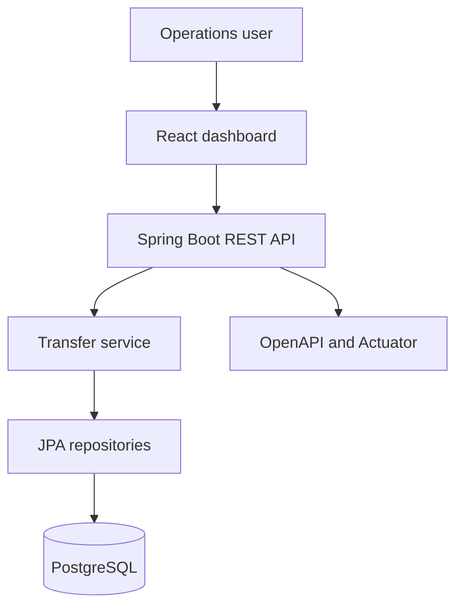

# CloudLedger

> A cloud-ready transaction operations dashboard built to demonstrate modern full-stack engineering, transactional backend design, containerization, and automated quality checks.

[](https://github.com/hassanasim020/cloudledger/actions)
[](https://openjdk.org/)
[](https://spring.io/projects/spring-boot)
[](https://react.dev/)
[](LICENSE)

CloudLedger is a portfolio-scale financial operations application. It provides a responsive dashboard for viewing corporate accounts, monitoring ledger activity, and executing validated internal transfers. The project focuses on clean boundaries, database transactions, API-first development, and reproducible deployment.

> **Portfolio disclaimer:** This is an independent educational project using synthetic data. It is not affiliated with a bank, employer, or banking software vendor and is not intended for production financial use.

## Highlights

- Responsive React + TypeScript operations dashboard
- REST API implemented with Spring Boot and Jakarta Validation
- Atomic transfers using Spring's `@Transactional` boundary
- H2 zero-setup local profile and PostgreSQL container profile
- Centralized, consistent API error responses
- OpenAPI documentation through Swagger UI
- Health, metrics, and readiness endpoints through Actuator
- Unit tests for critical transfer rules and frontend smoke coverage
- Multi-stage Docker images and a one-command Docker Compose environment
- GitHub Actions pipeline for backend verification and frontend test/build
- Non-root runtime user and minimal production container images

## Architecture



The frontend and API are independently deployable. Nginx serves the compiled single-page application and proxies `/api` calls to the backend. The service layer owns business rules and the transaction boundary; repositories own persistence.

## Technology

| Layer | Technologies |
| --- | --- |
| Frontend | React, TypeScript, Vite, Vitest |
| Backend | Java 17, Spring Boot, Spring Data JPA, Bean Validation |
| Data | PostgreSQL 16, H2 for zero-setup development |
| API & operations | REST, OpenAPI/Swagger, Spring Boot Actuator |
| Delivery | Docker, Docker Compose, Nginx, GitHub Actions |

## Business Rules Demonstrated

- Source and destination accounts must differ.
- Both accounts must exist and remain active.
- Transfer currency must match both accounts.
- The source must have sufficient funds.
- Debit, credit, and ledger record are committed atomically.
- Invalid requests return predictable HTTP `400` responses.

## Run with Docker

Requirements: Docker Desktop or Docker Engine with Compose.

```bash
git clone https://github.com/hassanasim020/cloudledger.git
cd cloudledger
cp .env.example .env
docker compose up --build
```

Open:

- Dashboard: <http://localhost:3000>
- Swagger UI: <http://localhost:8080/swagger-ui.html>
- Health endpoint: <http://localhost:8080/actuator/health>

The application seeds three synthetic accounts and one transaction on the first run.

## Run for Development

Start the backend with an in-memory H2 database:

```bash
cd backend
mvn spring-boot:run
```

Start the frontend in another terminal:

```bash
cd frontend
npm install
npm run dev
```

Open <http://localhost:5173>. Vite proxies API requests to port `8080`.

## API Examples

List accounts:

```bash
curl http://localhost:8080/api/v1/accounts
```

Create a transfer using account IDs returned above:

```bash
curl -X POST http://localhost:8080/api/v1/transactions/transfer \
  -H "Content-Type: application/json" \
  -d '{
    "sourceAccountId": "SOURCE_UUID",
    "destinationAccountId": "DESTINATION_UUID",
    "amount": 25000,
    "currency": "PKR"
  }'
```

## Tests

```bash
cd backend && mvn test
cd ../frontend && npm test -- --run
```

Every push and pull request runs the same checks through GitHub Actions.

## Project Structure

```text
cloudledger/
├── backend/                 Spring Boot REST API
│   └── src/
│       ├── main/            Domain, service, API, configuration
│       └── test/            Business-rule unit tests
├── frontend/                React + TypeScript dashboard
│   └── src/                 UI, API client, types, tests
├── .github/workflows/       Continuous integration
├── docker-compose.yml       Local cloud-style environment
└── README.md                Architecture and operating guide
```

## Engineering Decisions

- **Modular monolith for the MVP:** faster delivery and simpler operations while maintaining domain boundaries that can later become services.
- **Database transaction for transfers:** consistency matters more than artificial microservice complexity at this scale.
- **Separate runtime profiles:** H2 makes evaluation easy; PostgreSQL represents the deployed architecture.
- **API-first integration:** the web client consumes the same documented interface available to any future mobile client.

## Roadmap

- [ ] JWT authentication with role-based access control
- [ ] Idempotency keys for transfer requests
- [ ] Optimistic locking for concurrent balance updates
- [ ] Immutable double-entry ledger model
- [ ] Pagination, filtering, and audit search
- [ ] OpenTelemetry traces and Grafana dashboards
- [ ] Infrastructure as Code deployment to AWS or Azure

## Author

**Muhammad Hassan Asim**  
Software Engineer focused on full-stack development, enterprise systems, and cloud architecture.

- [GitHub](https://github.com/hassanasim020)
- [LinkedIn](https://www.linkedin.com/in/muhammad-hassan-asim-004308214/)

## License

Licensed under the [MIT License](LICENSE).
